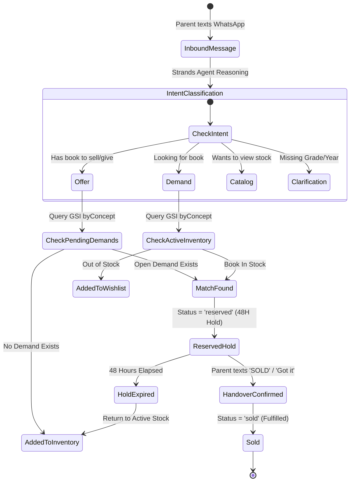

# Relay 📚 — End-to-End System Architecture Specification
### Autonomous Parent School Textbook Marketplace & Matchmaker
**Competition:** [AWS Agents for Humans Hackathon (Devpost)](https://agentsforhumans.devpost.com/)  
**Track Alignment:** *Everyday Agents* / *Good Neighbor Agents*  
**Core Framework:** Strands Agents SDK (`@aws-blocks/bb-agent` / `Agent`) & AWS Blocks  

---

## 1. Executive Summary & Architectural Vision

Relay is an autonomous AI agent engineered to eliminate the high friction, time loss, and administrative burden of school textbook acquisition and recycling. Instead of requiring parents to download and manage another standalone app, Relay operates autonomously in the background across **WhatsApp** and the **Web**.

### Core Architecture Tenets:
1. **Autonomous Background Operation:** Operates in the background, continuously categorizing listings, indexing community wishlists, and executing proactive buyer-seller matching without human polling.
2. **Sub-3s SLA & Non-Blocking Webhook Execution:** Uses an asynchronous event-driven design to acknowledge Meta WhatsApp Cloud API webhooks in milliseconds, executing the Strands Agent loop in the background.
3. **Enterprise Defense-in-Depth:** Features AWS WAF v2, HMAC-SHA256 payload verification, in-prompt PII redaction, KMS Customer Managed Key (CMK) envelope encryption, and 30-day S3 automated lifecycle expiration.
4. **Observable & Resilient:** Instrumented end-to-end with AWS X-Ray distributed tracing (`Tracer`) and Amazon CloudWatch Embedded Metric Format (`Metrics`).

---

## 2. High-Level Architecture Diagram

```mermaid
flowchart TD
    subgraph Layer1["1. Ingress & Clients"]
        Parent["📱 Parent on WhatsApp\n(+237 / +33 / International)"]
        MetaAPI["⚡ Meta WhatsApp Cloud API\n(Graph API v25.0)"]
        WebApp["🌐 Web App & Admin Dashboard\n(CloudFront + Vite SPA)"]
        WS["⚡ Realtime WebSocket Channel\n(Token & Block Streaming)"]
        Secrets["🔑 AWS Secrets Manager\n(Dynamic TTL Caching)"]
    end

    subgraph Layer2["2. Security & Gateway"]
        WAF["🛡️ AWS WAF v2\n(Rate Limiting & IP Shield)"]
        APIGW["🚪 Amazon API Gateway\n(POST /webhook & POST /aws-blocks/api)"]
        HMAC["🔒 HMAC-SHA256 Verifier\n(timingSafeEqual)"]
        PII["🛡️ Pre-Prompt PII Redactor\n(Regex Phone/Email/Address Masking)"]
        KMS["🔐 AWS KMS CMK\n(Envelope Encryption)"]
    end

    subgraph Layer3["3. Strands Agents & Compute Engine"]
        AgentCore["🤖 Strands Agent Core (booksAgent)\n(Model-Driven Multi-Turn Reasoning)"]
        Bedrock["🧠 Amazon Bedrock (BALANCED)\n(Claude 3.5/3.7 Sonnet)"]
        
        subgraph Tools["Agent Tool Ecosystem (Zod)"]
            T1["🔍 searchInventory"]
            T2["📋 listDemands"]
            T3["➕ createDemand"]
            T4["📚 registerBookOffer"]
        subgraph Tools["Agent Tool Ecosystem (Zod)"]
            T1["🔍 searchInventory"]
            T2["📋 listDemands"]
            T3["➕ createDemand"]
            T4["📚 registerBookOffer"]
            T5["👨‍👩‍👧 getSellerCatalog"]
            T6["📢 getSupplyDeficits"]
        end
        
        SubCatalog["📖 Declarative SUBJECT_CATALOG\n(4-Stage Regex Normalizer & Translator)"]
        Matchmaker["🎯 Proactive Matchmaker\n(GSI byConcept + 4-Digit Handover Code)"]
        HoldCron["⏰ EventBridge CronJob: holdExpiryCron\n(rate: 15 mins • Automated Hold Sweeper)"]
        InteractiveUX["📱 Meta Interactive List & 2-Button Cards\n(2-Tier Drawer + Safety Confirmation)"]
        Outbound["📤 WhatsApp Outbound Dispatcher\n(sendWhatsAppTextMessage & Interactive)"]
        DurableEngine["⚙️ Lambda Durable Step Engine\n(withDurableExecution & Idempotency)"]
    end

    subgraph Layer4["4. Persistence, Vectors & Observability"]
        DynamoInv[("📊 DynamoDB: active-inventory\nPK: itemId | GSI: byConcept\nStatus: active, reserved, sold")]
        DynamoDemand[("📋 DynamoDB: demand-board\nPK: demandId | GSI: byConcept\nStatus: pending, matched, fulfilled")]
        S3Bucket[("🖼️ S3: parent-book-images\n⏳ 30-Day Auto-Expiration Policy")]
        VectorKB[("🧠 Bedrock KnowledgeBase\n✂️ <= 2048 Byte Chunk Limit")]
        EventBridge["📡 EventBridge Lifecycle Stream\n(ProcessingStarted, MatchFound, HoldExpired, etc.)"]
        CloudWatch["📈 CloudWatch EMF Metrics\n(Namespace: BooksApp/WhatsAppMarketplace)"]
        XRay["🔍 AWS X-Ray Tracing\n(End-to-End Distributed Traces)"]
    end

    Parent -->|1. Natural Text / Photo| MetaAPI
    MetaAPI -->|2. Webhook Event| WAF
    WAF --> APIGW
    APIGW -->|3. Raw Body + Signature| HMAC
    HMAC -->|4. Valid Payload| PII
    PII -->|5. Non-blocking Async Dispatch| AgentCore
    
    AgentCore <-->|Inference| Bedrock
    AgentCore --> Tools
    T1 <--> DynamoInv
    T2 <--> DynamoDemand
    T3 --> DynamoDemand
    T4 --> DynamoInv
    T5 <--> DynamoInv
    T6 <--> DynamoDemand
    
    AgentCore --> SubCatalog
    SubCatalog --> Matchmaker
    Matchmaker -->|Lock 48H Hold| DynamoInv
    Matchmaker -->|Update Demand| DynamoDemand
    HoldCron -->|15-Min Sweep Expired Holds| DynamoInv
    HoldCron -->|Reset Stale Wishlists| DynamoDemand
    Matchmaker --> InteractiveUX
    InteractiveUX --> Outbound
    Outbound -->|6. WhatsApp Outbound Message| MetaAPI
    MetaAPI -->|7. Delivery| Parent

    AgentCore -->|Streaming Chunks| WS
    WS --> WebApp
    WebApp <-->|JSON-RPC| APIGW
    
    DurableEngine --> EventBridge
    DurableEngine --> CloudWatch
    DurableEngine --> XRay
    DurableEngine --> S3Bucket
    DurableEngine --> VectorKB
```

---

## 3. Layer-by-Layer Architectural Breakdown

### Layer 1: Ingress, Clients & Ingestion
* **Parent Community (WhatsApp):** Primary consumer interface. Parents upload book cover photos or send natural language messages in English or French without learning commands.
* **Meta WhatsApp Cloud API (Graph API v25.0):** Inbound webhooks sent to API Gateway with cryptographic signature headers (`X-Hub-Signature-256`), receiving 2-tier interactive list drawers and 2-button confirmation cards.
* **Web Single Page Application:** Deployed via Amazon CloudFront and S3 static hosting, offering parent catalog browsing, seller storefront grade bundles, and live Strands Agent chat.
* **WebSocket Realtime Stream:** Powered by `@aws-blocks/bb-realtime`, streaming LLM tokens/blocks to the browser in real time.
* **AWS Secrets Manager:** Dynamically caches Meta WhatsApp API tokens with 5-minute in-memory TTL caching.

---

### Layer 2: Enterprise Security & Governance Boundary
* **AWS WAF v2:** Rate-limiting policies (100 requests / 60 seconds per IP), IP reputation lists, and managed Core Rule Sets (CRS) against SQLi and XSS.
* **Cryptographic HMAC-SHA256 Validation:** Evaluates payload signatures with `crypto.timingSafeEqual` to prevent timing attacks.
* **In-Prompt PII Redaction (`maskPromptPII`):** Strips international phone numbers (`+237...`, `+33...`), emails, and physical street addresses prior to Amazon Bedrock prompt injection, preserving data privacy while maintaining deterministic matching keys.
* **AWS Secrets Manager with Dynamic TTL Cache:** WhatsApp access tokens, phone number IDs, and app secrets are fetched dynamically with a 5-minute in-memory TTL cache.

---

### Layer 3: Strands Agents SDK & Reasoning Engine
* **Model-Driven Reasoning Loop (`booksAgent`):** Built with the open-source **Strands Agents SDK**, using `BedrockModels.BALANCED` (Claude 3.5/3.7 Sonnet). The agent autonomously decides whether to look up inventory, register offers, post wishlist demands, or clarify ambiguous grades.
* **Type-Safe Zod Tool Ecosystem:**
  | Tool Name | Parameters Schema | Purpose |
  | :--- | :--- | :--- |
  | `searchInventory` | `concept?`, `domain?`, `query?` | Scans active inventory for available books. |
  | `listDemands` | `concept?` | Retrieves community wishlist demands. |
  | `createDemand` | `userPhone`, `requestedQuery`, `concept`, `domain?` | Registers out-of-stock demands. |
  | `registerBookOffer` | `sellerPhone`, `title`, `concept`, `domain`, `condition` | Lists new books and triggers matchmaker. |
  | `getSellerCatalog` | `sellerPhone` | Queries all books listed by a specific parent. |
* **48-Hour Reserved Hold Lock:** When a match is identified, the book is placed in a `reserved` hold with a 4-digit handover code. It is excluded from public search queries for 48 hours to give the parents time to complete the exchange.

---

### Layer 4: Persistence, Knowledge Base & Telemetry
* **Amazon DynamoDB (`DistributedTable`):**
  * `active-inventory`: Partition Key `itemId`. Global Secondary Index (GSI) `byConcept` (`concept` PK, `createdAt` SK).
  * `demand-board`: Partition Key `demandId`. GSI `byConcept` (`concept` PK, `createdAt` SK).
* **Amazon S3 Automated 30-Day Lifecycle (`FileBucket`):** Automatically deletes ingested textbook photos after 30 days to minimize long-term storage liability.
* **Bedrock Knowledge Base & S3 Vectors:** Strict 2,048-byte chunk size enforcement (`chunkTextForVectorStore`) for semantic similarity searches.
* **Telemetry & Observability:**
  * **AWS X-Ray (`Tracer`):** Distributed trace segments across webhooks, Bedrock calls, DynamoDB queries, and outbound SMS.
  * **CloudWatch EMF (`Metrics`):** Custom namespace `BooksApp/WhatsAppMarketplace` tracking latencies, match success rates, throttling errors, and token counts.

---

## 4. Matchmaking & Transaction Lifecycle State Machine



---

## 5. Security, Compliance & Governance Summary

| Governance Dimension | Implementation Mechanism | SLA / Standard |
| :--- | :--- | :--- |
| **Ingress Filtering** | AWS WAF v2 + Meta HMAC-SHA256 | Timing-safe verification; block tampered webhooks |
| **Data Privacy (PII)** | Pre-prompt regex scrubbing (`maskPromptPII`) | Zero raw phone numbers sent to LLM prompt |
| **Data Retention** | Amazon S3 Lifecycle Expiration Rules | Hard deletion after 30 days |
| **Encryption at Rest** | AWS KMS Customer Managed Key (CMK) | AES-256 Envelope Encryption across DynamoDB & S3 |
| **Operational Health** | CloudWatch Embedded Metric Format | Real-time alarms for delivery & throttling errors |
| **Distributed Tracing** | AWS X-Ray Custom Subsegments | Full transaction lineage from webhook to SMS delivery |
