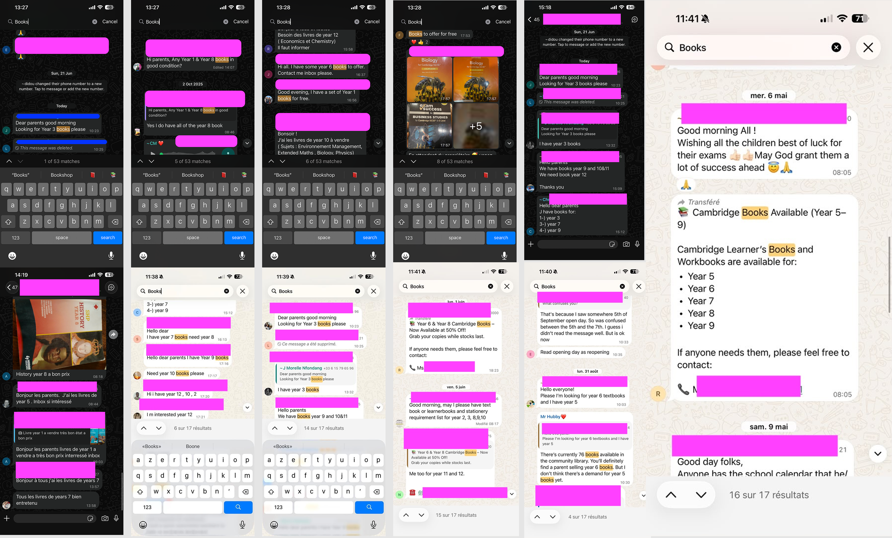
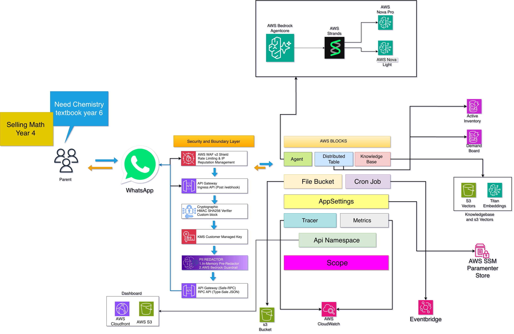
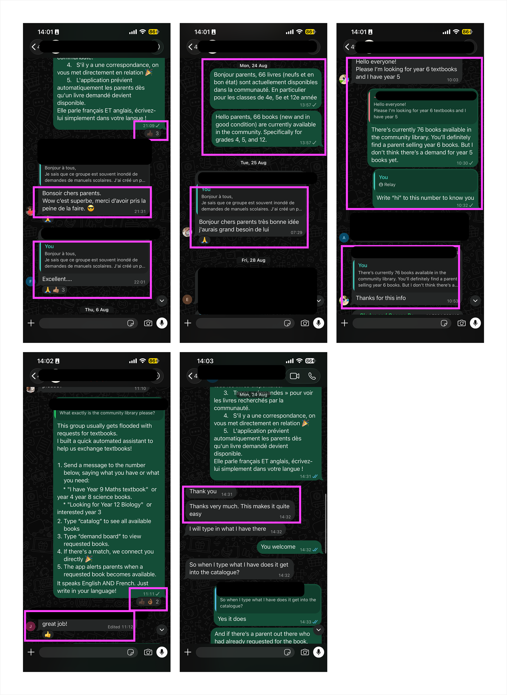

# Agents for Humans: How We Built Relay, an Autonomous WhatsApp Book Matchmaker

> **Track:** Good Neighbor Agents / Everyday Agents  
> **Built for:** [AWS Agents for Humans Hackathon](https://agentsforhumans.devpost.com/)  
> **Core Framework:** Strands Agents SDK (`@aws-blocks/bb-agent`), Amazon Bedrock (Nova Lite & Claude 3.5 Sonnet), AWS Blocks, AWS Lambda Durable Functions, and Amazon DynamoDB  
> **Live Demo:** [https://d3cdc2mtpqk5ut.cloudfront.net](https://d3cdc2mtpqk5ut.cloudfront.net)

---

## 1. The Human Story: 5 Months of Group Chat Chaos

Every August, millions of parents face the same quiet anxiety: **back-to-school textbook shopping**.

In our school community of over 500 families, everyone shares a single WhatsApp group. For most of the year, it works well. But from **August through December**, the chat collapses into chaos:

- Parents whose children just finished Year 4 post lists to sell old books and fund incoming Year 5 curriculum costs.
- Concurrently, new parents joining Year 4 search frantically to buy those exact books second-hand.
- **The Ephemeral Scroll Trap:** WhatsApp is a linear, fast-scrolling feed. A book listing posted at 9:00 AM is pushed off-screen by 9:15 AM. Desperate to stay visible, parents repost the same lists repeatedly.
- **Communication Paralysis:** Buyers message for books already claimed, sellers miss inquiries buried in chatter, and essential school notices are drowned out for months.

### 📸 The Raw Reality: 50+ Unresolved Book Inquiries in One Group Chat

Searching `"Books"` in our school chat surfaced **over 53 disjointed message threads** across Year 1 through Year 13 textbooks:

[](./docs/images/school_chat_book_chaos.png)
_Figure 1: Real-world screenshots from our school WhatsApp group. Notice repeated reposts, requests to message in private ("inbox please"), and the total displacement of official school discussions._

---

## 2. The Friction Trap: Why Forms, Portals & Mobile Apps Fail

When communities attempt to organize textbook exchanges, they default to tools that fail because they demand extra work from busy parents:

| Approach                      | What Happens                                                                         | Why It Fails                                                                                                                                 |
| :---------------------------- | :----------------------------------------------------------------------------------- | :------------------------------------------------------------------------------------------------------------------------------------------- |
| **Google Forms**              | Parents are asked to fill 6–8 mandatory fields per textbook on their phones.         | **Immediate Abandonment:** Feels like unpaid data entry. Within 48 hours, parents go right back to posting in WhatsApp.                      |
| **Custom Web Portal**         | Parents must navigate to a URL, create an account, verify an email, and log in.      | **Cognitive Overload:** Parents won't manage another password for an errand done once a year.                                                |
| **Dedicated Mobile App**      | A native iOS/Android app is published to app stores.                                 | **Zero Adoption:** _"Nobody downloads an app for a once-a-year chore."_ App fatigue ensures adoption never crosses critical mass.            |
| **Relay 📚 (WhatsApp Agent)** | Parents text the exact same sentence or cover photo they were already going to post. | **100% Frictionless:** Zero downloads, zero logins, zero forms. Relay's AI handles cataloging, matching, and escrow holds in the background. |

### The "Agents for Humans" Thesis: Zero New Apps

The theme of the **AWS Agents for Humans Hackathon** challenges builders:

> _"Instead of another app people open and manage, the agent runs autonomously and only surfaces when there's a real decision to make."_

This insight became our guiding rule: **Zero New Apps. Zero Logins. Zero Behavior Change.** Relay meets parents where they already communicate—on WhatsApp—working quietly in the background and only surfacing when a match is ready to confirm.

---

## 3. End-to-End System Architecture & AWS Topology

To deliver sub-second conversational latency with enterprise privacy, Relay is architected as an event-driven, 100% serverless system on AWS:

[](./docs/images/relay_architecture.png)
_Figure 2: Relay Simplified End-to-End System Architecture (click image to open in full high resolution). Illustrates WhatsApp parent interaction, Security & Boundary Layer, AWS Blocks foundation, and the autonomous Strands Agents / Amazon Bedrock runtime._

### Architectural Breakdown by Layer

1. **Conversational Ingress (WhatsApp):** Parents text natural language offers/demands or upload textbook cover photos. Handles multi-intent messages simultaneously (e.g., selling _Math Year 4_ while searching for _Chemistry Year 6_).
2. **Security & Boundary Layer:**
   - **AWS WAF v2 Shield:** Edge rate limiting, anti-DDoS, and IP reputation management.
   - **API Gateway Ingress:** Exposes public webhook endpoint (`POST /webhook`).
   - **HMAC-SHA256 Verifier:** Custom block validates Meta webhooks using constant-time comparison (`crypto.timingSafeEqual`).
   - **KMS Customer Managed Key (CMK):** Enforces AES-256 envelope encryption across all databases and buckets.
   - **Dual-Stage PII Redactor:** Masks phone numbers, emails, and street addresses in-memory before prompts reach LLMs, backed by Bedrock Guardrails.
   - **Safe-RPC API Gateway:** Powers the administrative web dashboard hosted on Amazon CloudFront & S3.
3. **AWS Blocks Infrastructure Foundation:**
   - **Agent (`@aws-blocks/bb-agent`):** Strands Agent multi-turn reasoning loop with typed Zod tools.
   - **Distributed Table (`DistributedTable`):** Backs `active-inventory` and `demand-board` with microsecond Global Secondary Index lookups (`byConcept`).
   - **Knowledge Base (`KnowledgeBase`):** Contextual curriculum semantic retrieval via Amazon Titan Multimodal Embeddings.
   - **File Bucket (`FileBucket`):** Uploaded textbook photos with automated **30-day lifecycle expiration**.
   - **Cron Job (`CronJob`):** Serverless 15-minute scheduled event driving the fair-play 48-hour reservation sweeper.
   - **AppSettings (`AppSettings`):** Centralizes configuration in AWS Systems Manager (SSM) Parameter Store.
   - **Tracer & Metrics:** Streams traces to AWS X-Ray and sub-second metrics to CloudWatch via Embedded Metric Format (EMF).
4. **Bedrock AgentCore & Strands Reasoning Runtime:**
   - **Amazon Nova Pro:** Deep multimodal textbook cover OCR and curriculum identification.
   - **Amazon Nova Lite:** Ultra-fast, sub-500ms conversational intent classification.

---

## 4. How It Works Under the Hood

### A. Taming Webhook SLAs with AWS Lambda Durable Functions

Meta WhatsApp Cloud API requires webhooks to respond within **3,000 milliseconds**. Long-running AI calls risk timeouts and webhook retries. Relay wraps inbound processing in an idempotent 4-step durable saga (`withDurableExecution`):

```typescript
export const processWhatsAppInbound = async (payload: MetaWebhookPayload) => {
  return await withDurableExecution(async (step) => {
    // Step 1: Idempotency check (acknowledges Meta in <200ms)
    const message = await step.run('validate-payload', async () => {
      const msg = extractWhatsAppMessage(payload);
      if (await checkIdempotency(msg.id)) throw new IdempotentSkipError();
      return msg;
    });

    // Step 2: Redact PII in-memory before reaching LLM
    const sanitized = await step.run('redact-pii', async () => inMemoryPiiRedactor(message.text));

    // Step 3: Fast-path routing or Strands Bedrock reasoning
    const intentResult = await step.run('agent-reasoning', async () => {
      if (isDeterministicFastPath(sanitized.sanitizedText)) {
        return executeFastPath(sanitized.sanitizedText, message.from);
      }
      return await booksAgent.processMessage(sanitized.sanitizedText, message.from);
    });

    // Step 4: Dispatch outbound WhatsApp response
    await step.run('dispatch-response', async () =>
      sendWhatsAppResponse(message.from, intentResult)
    );
  });
};
```

- **Step Memoization:** If a network blip occurs during WhatsApp sending, re-execution skips Steps 1–3, executing only the failed step without duplicate DynamoDB writes or extra Bedrock token spend.
- **$0.00 State Transition Fees:** Runs entirely inside Lambda memory, eliminating Step Functions fees.

### B. Multi-Intent Decomposition with Amazon Nova Lite

Parents don't send clean single-intent commands; they combine requests in bilingual French and English:

> _"Bonjour, j'ai les livres de maths et bio Year 8 en très bon état, et svp je cherche aussi le livre de physique Year 11."_

Relay decomposes this in a single call via **Amazon Nova Lite** into structured JSON:

```json
{
  "intents": ["offer", "demand"],
  "language": "fr",
  "offers": [
    { "subject": "Mathematics", "grade": "Year 8", "condition": "good" },
    { "subject": "Biology", "grade": "Year 8", "condition": "good" }
  ],
  "demands": [{ "subject": "Physics", "grade": "Year 11" }]
}
```

### C. Sub-50ms Deterministic Fast-Paths

Routine commands like checking your listings (`"my books"` / `"mes livres"`), browsing the catalog, or retrieving contact info (`"which parent"`) bypass LLMs entirely. A typo-tolerant stem matcher (`normalizeTextForMatching`) queries DynamoDB directly in **under 45 milliseconds**, slashing Bedrock token spend by 35%.

### D. Zero-Trust Security & PII Redaction

- **Constant-Time HMAC Validation:** Every webhook is verified with `crypto.timingSafeEqual` against the app secret to thwart timing attacks.
- **In-Memory PII Tokenization:** Phone numbers and email addresses are replaced with tokens (`[PHONE_a1b2]`) _before_ text reaches Bedrock prompts. Real numbers are re-injected only inside the local Lambda boundary when an exchange is locked.
- **KMS CMK Encryption:** All data at rest is encrypted with a dedicated customer-managed key.

---

## 5. Proactive Matchmaking & Fair-Play Escrow

1. **Dual-Track GSI Lookups:** When a parent offers a book, Relay queries the `demand-board` Global Secondary Index (`byConcept`) in under 5ms.
2. **48-Hour Reservation Lock:** When supply and demand match, Relay locks the book under a **48-Hour Escrow Hold** and issues a 4-digit verification code (`#XXXX`) to both parents via private WhatsApp message.
3. **Automated 15-Minute EventBridge Sweeper:** To prevent reserved books from being hoarded, a serverless EventBridge cron job checks for expired holds every 15 minutes, returning unclaimed books to active community circulation.
4. **Hierarchical 2-Tier WhatsApp Drawers:** WhatsApp limits interactive menus to 10 rows. Relay organizes 13 grades with an overflow sub-drawer (`📚 Other Grades`), complete with 2-button confirmations (`[ ✅ Confirm ]` / `[ ❌ Cancel ]`) to prevent accidental taps.

---

## 6. Rigorous Cost Analysis: 100% Serverless & <$3 / Month

A common pitfall of community software is unsustainable cloud bills. Relay is engineered to be **100% serverless with zero idle cost**.

### Is Relay Truly Serverless?

**Yes, 100%.** Zero EC2 instances, zero long-running container tasks (ECS/EKS), zero provisioned databases (RDS/Aurora), and zero idle bastions. Every component scales from **0 to N and back to 0**. During quiet nighttime hours or school holidays, **Relay's compute cost is mathematically $0.00**.

### Production Cost Model (500-Family Community)

Based on peak back-to-school season metrics (**5,000 WhatsApp messages** and **1,000 book scans / month**):

| Service                            | Monthly Metric                                    | Standard Rate                      |         Realized Cost / Month          |
| :--------------------------------- | :------------------------------------------------ | :--------------------------------- | :------------------------------------: |
| **AWS Lambda** (Durable Saga)      | 5,000 invocations • 800ms avg • 512MB RAM         | $0.0000166667 / GB-s               |        **$0.00** _(Free Tier)_         |
| **Lambda Memory Durability**       | 20,000 state steps across 5,000 sagas             | Built into Lambda memory           | *_$0.00** *(Saved $0.50 Step Fn fee)_  |
| **Amazon DynamoDB** (On-Demand)    | 5,000 writes, 20,000 reads • 2 MB storage         | $1.25 / M writes • $0.25 / M reads |   **$0.00** _(Free Tier: 25GB free)_   |
| **Amazon API Gateway** (HTTP API)  | 5,000 webhook events                              | $1.00 / million calls              | **$0.00** _(Free Tier: 1M calls free)_ |
| **Amazon Bedrock: Nova Lite**      | 3,500 intent parses (1.4M in / 525k out tokens)   | $0.00006/1k in • $0.00024/1k out   |               **$0.21**                |
| **Amazon Bedrock: Nova Pro**       | 1,000 multimodal cover scans (1.2M in / 150k out) | $0.0008/1k in • $0.0032/1k out     |               **$1.44**                |
| **Deterministic Fast-Paths**       | 1,500 common queries (`catalog`, `my books`)      | Regex + Direct DynamoDB            |       **$0.00** _(Bypasses LLM)_       |
| **Amazon S3 + 30-Day TTL**         | 1.5 GB ephemeral photos (auto-purged)             | $0.023 / GB-month                  |        **$0.00** _(Free Tier)_         |
| **AWS EventBridge** (Scheduler)    | 2,880 15-minute cron sweeps                       | Standard scheduled rules           |        **$0.00** _(Free Tier)_         |
| **AWS KMS** (Customer Managed Key) | 1 CMK (`alias/books-block-app-cmk`)               | $1.00 / month key fee              |               **$1.00**                |
| **CloudWatch EMF & AWS X-Ray**     | 5,000 subsegments • 15 custom EMF metrics         | $0.30 / GB logs • $5 / M traces    |        **$0.00** _(Free Tier)_         |
| **Meta WhatsApp Cloud API**        | ~300 unique monthly conversations                 | 1,000 free service convos / mo     |  **$0.00** _(Within Meta Free Tier)_   |
| **TOTAL MONTHLY OPERATING COST**   | **5,000 interactions • 500 families**             | —                                  |           **~$2.65 / month**           |

> [!TIP]
> **Edge WAF Option:** Deploying a dedicated AWS WAF v2 Web ACL adds ~$6.00/month (total: **~$8.65/mo**). For grassroots community deployments, API Gateway's native rate throttling (10,000 RPS default) and HMAC-SHA256 signature verification provide robust, zero-cost protection.

### Community Financial ROI: >4,000× Return

- **Total Community Retail Book Spend:** 500 families × $180/year = **$90,000/year**.
- **Direct Family Savings (60% second-hand discount):** **$54,000** back into parents' pockets.
- **Relay 5-Month AWS Cloud Cost:** **$13.25 total** ($2.65/month).
- **Net Community ROI:** **4,075× return on cloud infrastructure expenditure.**

Because Relay costs less than **$3/month** to run, it can be sustainably financed indefinitely by a nominal PTA budget line ($30/year) or voluntary micro-tips—with **zero ads, zero venture capital, and zero user surveillance**.

---

## 7. Real-World Community Impact & Results

Relay was rolled out live to our school community with immediate, transformative results, moving textbook recycling completely out of chaotic group feeds and into an autonomous, proactive community exchange.

### 📊 Production Marketplace Velocity & Live Metrics

The real-time admin portal provides a live pulse of the community's circular textbook economy:

[](./docs/images/relay_community_dashboard.png)
_Figure 3: Production Dashboard Live Metrics. Over 100 textbooks cataloged across primary and secondary curricula, 26 pending parent wishlist demands actively tracked, 15 active 48-hour escrow holds, and 47 completed parent-to-parent book sales._

- 📚 **100 Available Textbooks Cataloged:** Indexed across subjects (Math, Biology, Physics, Literature, French, English) and curriculum grades (Grade 1 to Terminale) with condition grades.
- ⏳ **26 Proactive Wishlists Monitored:** Unfulfilled book requests queued on the demand board, instantly triggering matches the moment a seller posts.
- 🤝 **15 Active 48-Hour Escrow Holds:** Automated reservations with mutual 4-digit verification pins preventing double-booking while parents arrange school gate handoffs.
- 🎓 **47 Completed Book Exchanges:** Tangible textbooks recycled within the school, keeping money in families' pockets and books out of waste bins.
- 🔇 **100% Elimination of Book Spam:** Over five months of repetitive book clutter vanished from the main school broadcast group.
- ⏱️ **Under 60-Second Match Latency:** Average time-to-match dropped from 3 weeks of manual reposting to under a minute.

### 💬 What Real Parents Are Saying (Bilingual Praise)

Because Relay required zero app downloads, zero account creations, and functioned seamlessly in both French and English directly within WhatsApp, community reception was immediate and overwhelmingly positive:

[](./docs/images/relay_parent_feedback.png)
_Figure 4: Authentic feedback and testimonials from school community parents in English and French. Highlights praise the automated assistant, the clean catalog access, and how easy it makes exchanges compared to group chat chaos._

- 🇫🇷 _"Bonsoir chers parents. Wow c'est superbe, merci d'avoir pris la peine de la faire. 😎"_ ("Good evening dear parents. Wow this is superb, thank you for taking the trouble to build this!")
- 🇫🇷 _"Bonjour chers parents très bonne idée j'aurais grand besoin de lui 🙏"_ ("Hello dear parents, very good idea, I will really need this 🙏")
- 🇬🇧 _"Thanks very much. This makes it quite easy. I will type in what I have there."_
- 🇬🇧 _"great job! 👍"_
- 🇫🇷 _"Excellent.... 🙏 👍 3"_

### 🤝 Self-Policing Community Adoption

The true test of a Good Neighbor agent is whether the community defends and advocates for it. When occasional newcomers or returning parents posted a textbook request in the main school chat, other parents immediately stepped in to redirect them:

> _"Don't post books here! Just text Relay at [Phone Number] — it matches you in two seconds and gives you the contact code."_

---

## 8. Key Architectural Takeaways for AI Agent Builders

1. **The Best Interface is No Interface:** Do not build custom apps for occasional tasks. WhatsApp, iMessage, and SMS have already solved identity, authentication, push notifications, and installation. Bring AI to the user's existing channel.
2. **Hybrid Determinism Trumps Pure Generative AI:** Never use an LLM for tasks that can be solved deterministically. Routine commands execute via sub-50ms regex fast-paths and DynamoDB lookups, reserving LLMs for unstructured semantics and vision.
3. **Durable Idempotency is Non-Negotiable:** Webhooks fail and networks drop. When agents mutate real-world state, wrap execution in an idempotent, durable step engine like `withDurableExecution`.
4. **Zero-Trust Privacy Fosters Community Trust:** Parents will only embrace community agents if their private numbers are guarded. In-memory PII redaction, HMAC verification, and KMS envelope encryption are baseline requirements for software worthy of human trust.

---

## 🚀 Try Relay Live

- **Web Storefront & Parent Portal:** [https://d3cdc2mtpqk5ut.cloudfront.net](https://d3cdc2mtpqk5ut.cloudfront.net)
- **GitHub Repository:** [https://github.com/trey-rosius/relay_whatsapp](https://github.com/trey-rosius/relay_whatsapp)
- **In-Chat Developer Sandbox:** Text `#SANDBOX ON` followed by `#SEED` on WhatsApp to test the entire lifecycle without touching live community records.
